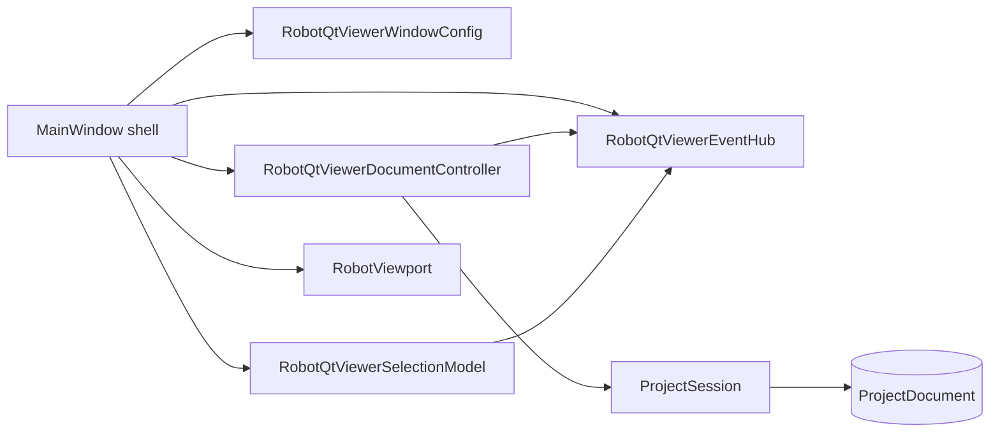
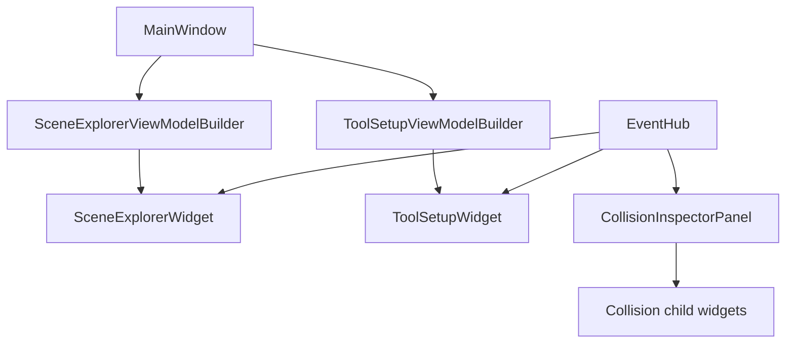
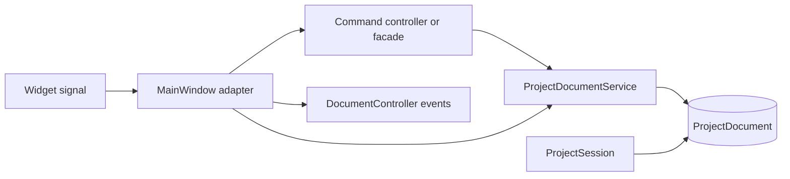
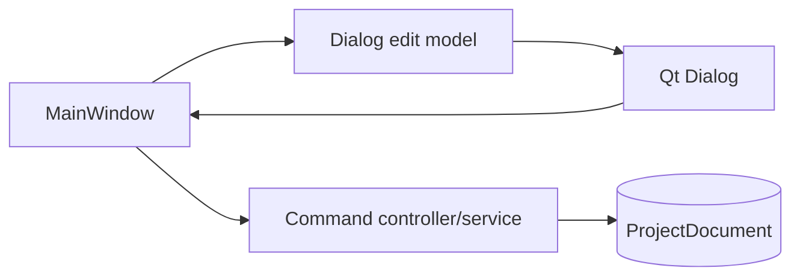
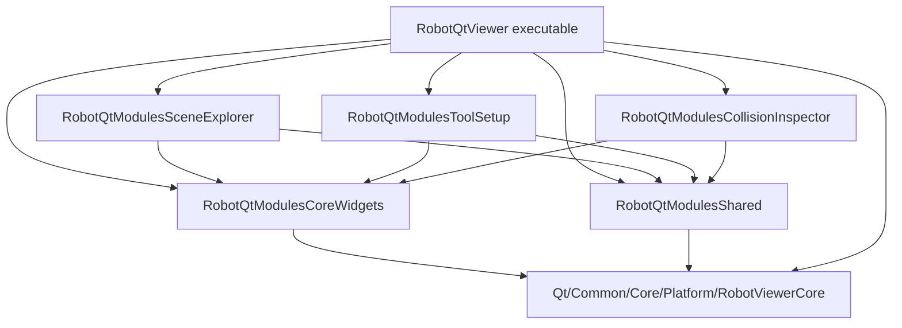

# RobotQtViewer Component Relationships

## Purpose

This document describes the current RobotQtViewer module relationships after the document/view/event-hub refactor. It focuses on ownership, message flow, and CMake layer boundaries.

## Top-Level Shape

MainWindow still composes the Qt application, but cross-panel updates now have a typed event path. Widgets continue to expose Qt signals for local user intent.

## Panel Flow

Current subscribers:

- `sceneExplorer`: project document, viewport reload, robot runtime, attachment, and selection events.
- `toolSetup`: selection, attachment, project document, and viewport reload events.
- `collisionInspector`: selection, collision, project document, viewport reload, and robot runtime events.

## Document Mutation Flow

The design goal is to move more of the `MainWindow --> Service` direct path into command controllers or platform services. Persistent document edits should not be owned by widgets.

## Dialog Flow

旧 Dialogs 过渡模块已删除。若后续确实需要 modal editor，应作为拥有模块的局部 UI 评估；默认路径是模块 task panel 和 view model。
Tool attachment instance 编辑、已有 robot mount transform/link 编辑以及 mount 新增/空 mount 删除入口已迁入 ToolSetup task panel，不再使用 dialog edit model。Robot base transform 和 scene object transform 已迁入 SceneExplorer task panel，不再通过 viewer-side transform dialog workflow 作为主入口。

collision detector 新增/编辑已迁入 CollisionInspector task panel；base transform、flange、tool asset designer、preview surface、collision detector dialog 和旧 edit model 已删除。

## CMake Layers

Layer responsibilities:

- `RobotQtModulesCoreWidgets`: visual Qt widgets, view models, builders, and small UI utilities.
- `RobotQtModulesShared`: app controller, event hub, document controller, selection model, command controllers, facades, viewport service interface, and app document helpers.
- `RobotQtModulesSceneExplorer`: scene tree, context menu intents, and robot/object transform task panel.
- `RobotQtModulesToolSetup`: tool/mount task panel and tool attachment commands.
- `RobotQtModulesCollisionInspector`: collision UI and workbench controllers.
- `RobotQtViewer`: executable shell, `MainWindow`, shell adapters, action router, language, and theme.

## Rules For New Code

1. Add new reusable panel rendering code to `RobotQtModulesCoreWidgets`, or to the owning module when it is module-specific.
2. Add cross-panel event publication or app command orchestration to `RobotQtModulesShared`.
3. Avoid new modal editors by default; prefer module task panels and view models. If a modal editor is still needed, keep it local to the owning module with explicit inputs and no persistent mutation.
4. Add only shell/composition code to `MainWindow` and the executable source list.
5. Use `RobotQtViewerWindowConfig` plus `RobotQtViewerEventHub` for cross-panel refresh, not ad hoc MainWindow refresh chains.
6. Keep durable document semantics in `SimulationProject`, `SimulationRuntime`, Core, Platform, or command services that can later move there.
