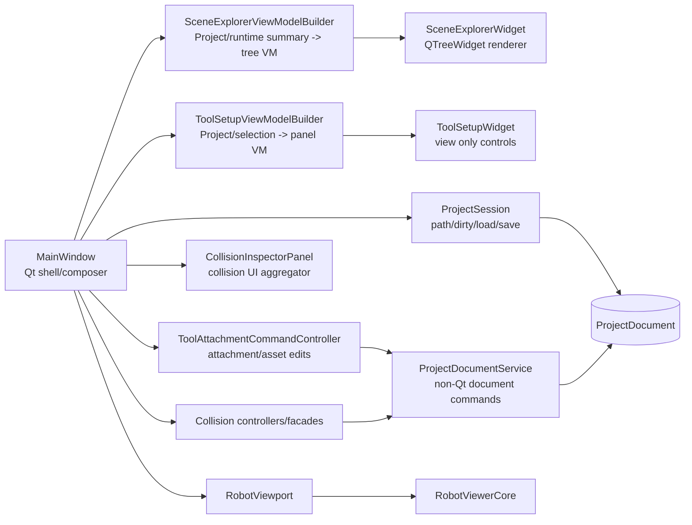

# RobotQtViewer Document/View Architecture

## Current Direction

RobotQtViewer is now moving from a MainWindow-centered implementation toward a document/view structure:

```text
MainWindow = Qt shell and composer
Widget = view only
ViewModel/Builder = display data shaping
Controller/Command = user intent to document/runtime operation
ProjectSession/ProjectDocumentService = non-Qt project ownership and mutation
RobotViewport/RobotViewerCore = runtime and rendering bridge
```

The important rule is that Qt owns interaction, not project semantics. If a behavior must also work in RobotGlfwViewer, a headless example, SDK use, or automated test, the semantic operation belongs in SMRobotPlatform or SMRobotCore, then RobotQtViewer calls it.

## Current Component Flow



## Phase 1-8 Result

The second-stage refactor changed these boundaries:

- SceneExplorer now has a semantic node ref and a `SceneExplorerViewModel`.
- Scene tree construction is no longer written as `new QTreeWidgetItem` in MainWindow. `SceneExplorerViewModelBuilder` builds the tree model, and `SceneExplorerWidget` renders it.
- Tool setup panel data is built by `ToolSetupViewModelBuilder`; `ToolSetupWidget` applies the view model.
- Tool attachment/asset edit writeback is routed through `ToolAttachmentCommandController` and `ProjectDocumentService`.
- Project open/load policy is partly owned by `ProjectSession`.
- Collision pair enabled/disable mutation is now in `ProjectDocumentService`.
- MainWindow still coordinates Qt actions, shell adapters, status messages, viewport reload, and top-level module wiring.
- SceneExplorer now owns the robot base / scene object transform task panel: the widget emits transform intent, the module controller previews through `RobotQtViewerViewportServices`, and document mutation goes through `SceneEntityWorkflowController`.
- SceneExplorer now also owns scene-node selection interpretation and preferred robot mount resolution. MainWindow asks `SceneExplorerModuleController` for selection intents and robot selection context instead of scanning `ProjectDocument` directly.
- `RobotQtViewerAppController` now owns the remaining shell-level document access needed by MainWindow: collision geometry visibility persistence and robot existence checks during viewport reload restore.
- `RobotQtViewerAppController` now also owns selected robot/link and `InspectorContext` write helpers, so MainWindow and ToolSetup shell adapters no longer compose those state writes manually.

Current measured indicators after the 2026-06-16 MainWindow document-access pass:

| Metric | Value | Meaning |
| --- | ---: | --- |
| `MainWindow.cpp` lines | 1918 | Shell is substantially smaller, but still owns file dialogs and viewport glue |
| `m_projectSession.document()` in MainWindow | 0 | Direct project document access has moved behind module/shared controllers |
| `QTreeWidgetItem*` in MainWindow | 0 | Tree item construction and tree schema parsing moved out |
| `new QTreeWidgetItem` / direct role fill in MainWindow | 0 | Tree construction moved out |

## Remaining MainWindow Responsibilities

These responsibilities are acceptable in MainWindow:

- QMainWindow lifetime.
- Menus, actions, toolbar, docks, global status messages.
- Widget/controller construction and signal wiring.
- File dialogs.
- Top-level viewport ownership.

These responsibilities should continue moving out:

- Direct project document mutation.
- Unique id generation.
- Import/attach rollback workflows.
- Collision command implementation that can be expressed as document service calls.
- Tree context menu actions that still operate through raw `QTreeWidgetItem*`.
- Viewport reload orchestration that mixes runtime load, selection restore, and panel refresh.

## Next Refactor Rules

When adding or modifying RobotQtViewer features:

1. Keep widgets as views. They should expose signals and accept view models, not own project mutation.
2. Put display shaping into a builder or controller when it reads project/runtime state.
3. Put persistent document mutation into `ProjectDocumentService`, `ProjectSession`, or another non-Qt platform/core service.
4. Let MainWindow connect the pieces and show status/errors, but avoid adding new long document workflows there.
5. Do not remove `ProjectIo.cpp` legacy readers unless old project migration is intentionally retired and covered by tests.

## Event Hub Update

The latest RobotQtViewer app layer adds a typed event path:

```text
RobotQtViewerWindowConfig
    declares modules and event subscriptions

RobotQtViewerEventHub
    owns the runtime subscription table

RobotQtViewerDocumentController
    publishes project/document/viewport/attachment/collision/status events

RobotQtViewerSelectionModel
    adapts Qt selection state to SimulationRuntime::ProjectSelectionState
```

This does not replace Qt signals inside widgets. Widget signals still express local user intent. The event hub is for cross-panel state changes such as project reload, selection change, attachment change, and collision document change.

Current event subscribers:

- `sceneExplorer`: project, viewport, runtime, attachment, and selection events.
- `toolSetup`: selection, attachment, project, and viewport events.
- `collisionInspector`: selection, collision, project, viewport, and runtime events.

## CMake Layering

`SMRobotApps/RobotQtViewer/CMakeLists.txt` 当前只构建 viewer shell executable，平级模块由 `SMRobotApps/RobotQtModules/CMakeLists.txt` 承载：

- `RobotQtModulesCoreWidgets`: widgets, view models, view model builders, and UI utilities shared by Qt modules.
- `RobotQtModulesShared`: app controller, event hub, document controller, selection model, document workflow, viewport service interface, command controllers, and facades.
- `RobotQtModulesSceneExplorer`: scene/document tree view, context menu intent model, and robot/object transform task panel.
- `RobotQtModulesToolSetup`: tool setup task panel and attachment/mount document commands.
- `RobotQtModulesCollisionInspector`: collision workbench UI and controllers.
- `RobotQtViewer`: shell executable with `main.cpp`, `MainWindow`, shell adapters, language, theme, toolbar, and action router code.

This split is still Qt app layer code. It does not move document semantics into Core or Platform by itself, but it makes ownership boundaries visible and prevents every new file from being added directly to the executable target.

## Dialog Boundary

旧 Dialogs 过渡模块已删除：

- `RobotQtModulesDialogs` target 已删除。
- `RobotQtViewerDialogs` alias 已删除。
- `CollisionDetectorDialog` 和 `RobotQtViewerDialogController` 已删除。
- base transform、flange、tool asset designer、preview surface 和旧 edit model 已删除。

新代码应优先使用模块 task panel 和 view model，不应恢复通用 dialog edit model。

collision detector 新增/编辑已迁入 `CollisionInspector` task panel：新增 detector 由 `CollisionDetectorWorkbenchController` 生成默认 descriptor，编辑 detector 复用属性面板和 `CollisionDetectorCommandController`。

当前 tool attachment instance 编辑、已有 robot mount 的 transform/link 编辑、mount 新增/空 mount 删除入口不再使用 dialog edit model，而是由 `ToolSetupPanelView` / `ToolSetupWidget` view model 表达，并通过 ToolSetup task action 或 apply/cancel 流程提交。

Robot base transform 和 scene object transform 也不再通过 `RobotBaseTransformDialog` 主路径编辑；它们已迁入 `SceneExplorerWidget` 的 transform task panel，并通过 `SceneExplorerModuleController` 调用 Shared document workflow。

## Current Boundary Status

MainWindow is closer to a shell/composer, but it is not finished:

- It still performs shell-level workflows such as file selection.
- It no longer directly calls `m_projectSession.document()`; remaining document access should stay behind module/shared controllers.
- It now has typed event publication points for project, selection, attachment, collision, and viewport reload.
- Scene tree construction, SceneExplorer transform editing, tool panel display shaping, and most collision child widgets are outside MainWindow.

Next migrations should keep reducing shell-level workflow branching in MainWindow by moving reusable commands into `ProjectDocumentService`, `ProjectSession`, module controllers, or small shared app controllers that can later move to Platform when they become non-Qt semantics.

