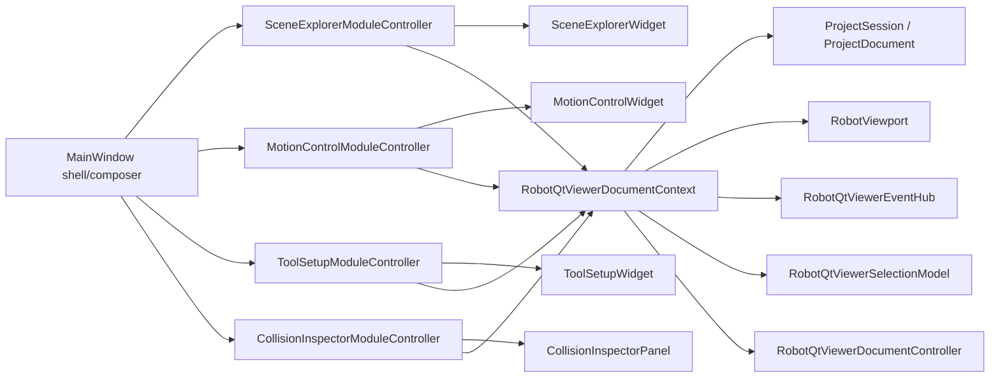

# RobotQtViewer Document-View Module Contract

本文记录 RobotQtViewer 在本轮 phase 1-10 后形成的窗口模块化和 document-view 契约。

## 分层关系

## 当前契约

- `MainWindow` 负责创建 dock、widget、controller、menu/action/status，并保留顶层跨模块命令。
- `RobotQtViewerDocumentContext` 是 Qt 模块读取项目会话、选择模型、事件中心、文档控制器和 viewport 的统一入口。
- `SceneExplorerModuleController` 持有 scene explorer 的运行时 robot/object 视图缓存，构建并刷新 `SceneExplorerWidget` 的 document view。
- `ToolSetupModuleController` 构建并刷新 tool setup document view，转发 mount、attachment、asset、frame visibility 用户意图。
- `MotionControlModuleController` 持有 motion 面板的可动关节 UI 状态，并从 viewport 同步关节显示值。
- `CollisionInspectorModuleController` 转发 collision panel 的用户意图，并把 EventHub 事件转换成刷新请求。
- 旧 `RobotQtViewerDialogController` 已删除；tool attachment、tool asset、robot base / scene object transform 和 collision detector 编辑均应优先走所属模块 task panel。

## Widget 规则

- 新的文档视图 widget 应优先暴露 `setDocumentView(...)`。
- 旧的 `setViewModel(...)` 可作为兼容入口保留，但新 controller 不应继续调用它。
- Widget 可以保存临时 UI 状态和发出用户意图信号。
- Widget 不应直接持久修改 `ProjectDocument`。

## Controller 规则

- Module controller 可以构建 view model、保存 UI 运行态缓存、订阅或处理 EventHub 事件。
- Module controller 可以通过 signal 向 MainWindow 暴露用户意图。
- 持久项目修改仍应进入 `ProjectDocumentService`、`ProjectSceneDocumentEditor`、`ToolAttachmentCommandController`、collision command/facade 或后续 SMRobotPlatform 服务。
- Controller 不应把 Qt-only 状态写成项目语义。

## MainWindow 剩余职责

MainWindow 目前仍保留以下跨模块命令，后续可以继续逐步迁移：

- project open/save/reload 和 viewport rebuild。
- robot/object 导入和删除。
- 仍未下沉的 tool/attachment、collision selection set、collision model 相关 shell glue。
- status bar 文案和全局错误提示。

## 后续执行规则

- 新增 panel 时先建 Widget，再建 ModuleController，再由 MainWindow 组合。
- 新增 document view 输入时使用 `setDocumentView(...)`。
- 新增跨窗口响应时优先通过 `RobotQtViewerEventHub` 和 controller 信号，不在 MainWindow 手写 widget-to-widget 传播。
- 新增持久项目修改时先找 Core/Platform 服务或命令控制器；没有合适接口时先补非 UI 接口，再接 Qt。
- 不再把新的 `QTreeWidgetItem` 构造或 project schema role packing 加回 MainWindow。
- `RobotQtViewerWindowConfig` describes module subscriptions and can be backed by JSON configuration.
- `RobotQtViewerDocumentViewRegistry` is the runtime registration table used by the shell/composer layer.
- `RobotQtViewerEventHub` remains the strong typed message channel; JSON is not the runtime event payload.
- Widgets do not subscribe to EventHub directly. Their ModuleController registers on their behalf.
- MainWindow should call `registerModule(moduleId, controller, handler)` instead of calling `RobotQtViewerEventHub::subscribeModule(...)` directly.
